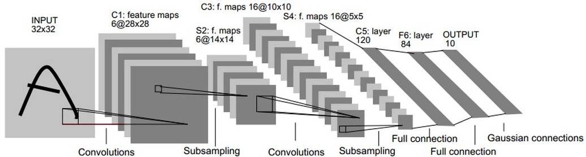

- [模型实践](#模型实践)
  - [1. LeNet-5](#1-lenet-5)
  - [2. GCN](#2-gcn)

# 模型实践
这里复现两个模型，分别是 Lecun Yann 的 LeNet-5 和 Thomas Kipf 的 GCN 。


## 1. LeNet-5

[LeNet-5](https://en.wikipedia.org/wiki/LeNet) 是一个经典的卷积网络，定义了许多卷积神经网络的经典结构（距今快30年了），包含了两层卷积层，两层激活层和三层线形层，框架如下



我们只需要将 chap4 中的 CNN 模型稍作修改即可，完整代码可以在 [include](./include/) 目录查看，这里给出部分关键代码

```cpp
// 构建函数
Lenet5::Lenet5(){
  conv1 = torch::nn::Conv2d(torch::nn::Conv2dOptions(1, 6, 5).padding(2));
  conv2 = torch::nn::Conv2d(torch::nn::Conv2dOptions(6, 16, 5));
  relu = torch::nn::ReLU();
  max_pool = torch::nn::MaxPool2d(2);
  lin1 = torch::nn::Linear(5 * 5 * 16, 120);
  lin2 = torch::nn::Linear(120, 84);
  lin3 = torch::nn::Linear(84, 10);
}

// 前向传播
torch::Tensor Lenet5::forward(torch::Tensor x){
  x = max_pool(relu(conv1(x)));
  x = max_pool(relu(conv2(x)));
  x = x.reshape({x.size(0), -1});
  x = lin1(x);
  x = lin2(x);
  x = lin3(x);
  return x;
}
```

定义好模型之后，需要准备 [MNIST](http://yann.lecun.com/exdb/mnist/) 数据集，在官网上下载四个压缩包并解压，将解压后的文件存放在 `${workspace}/chap5/data/MNIST/raw` 中。或者可以运行 [python 脚本](./python/PracticeModels.py) 的前45行，PyTorch 的 API 提供了 `download` 参数可以直接下载，但是 LibTorch 没有此选项，只能手动下载。

准备好之后，利用 `MNIST` 数据集类加载，第一个参数是路径，第二个参数是训练or测试数据。

```cpp
auto train_dataset =
      torch::data::datasets::MNIST("../data/MNIST/raw",
                                   torch::data::datasets::MNIST::Mode::kTrain)
          .map(torch::data::transforms::Stack<>());

auto test_dataset =
      torch::data::datasets::MNIST("../data/MNIST/raw",
                                   torch::data::datasets::MNIST::Mode::kTest)
          .map(torch::data::transforms::Stack<>());
```

`map()` 函数执行的功能是根据输入的转换类型进行格式转换，返回一个 `MapDataset`。对于 `Stack` 结构官网的解释是

```cpp
/// A `Collation` for `Example<Tensor, Tensor>` types that stacks all data
/// tensors into one tensor, and all target (label) tensors into one tensor.
```

个人理解这里是的意思是一种打包类型，将 `data` 和 `target` 分别合并，并通过 `Example` 结构模板向外提供获取接口。

然后通过 `make_data_loader` 模板函数创建 dataloader ，对训练数据采用 `RandomSampler` 以给模型引入噪声避免标签泄露和过拟合，对测试数据采用 `SequentialSampler` 提升数据访问性能。

```cpp
auto train_loader =
      torch::data::make_data_loader<torch::data::samplers::RandomSampler>(
          std::move(train_dataset), 128);
auto test_loader =
      torch::data::make_data_loader<torch::data::samplers::SequentialSampler>(
          std::move(test_dataset), 128);
```

训练过程和 chap4 中基本一致，但增加了内循环，以进行数据集分批的遍历，并计算总损失 `total_loss`。

```cpp
for (int i = 0; i < 5; i++) {
  torch::Tensor total_loss = torch::tensor(0.0);
  for (auto &batch : *train_loader) {
    torch::Tensor x = batch.data;
    torch::Tensor y = batch.target;
    torch::Tensor y_prob = lenet5.forward(x);
    torch::Tensor loss = cross_entropy(y_prob, y);
    total_loss += loss;
    adam.zero_grad();
    loss.backward();
    adam.step();
  }
  std::cout << "Epoch " << i << "  total_loss = " << total_loss.item() << std::endl;
}
```

随便跑一次的结果，注意看时间对比：

|               | LibTorch  | PyTorch  |
| ------------- | --------- | -------- |
| Test Accuracy | 98.56 %   | 98.64 %  |
| Total Loss    | 21.33     | 20.3501  |
| Time Duration | 0m36.685s | 1m7.996s |

（请忽略我电脑垃圾的性能🤣）


## 2. GCN

> 由于目前 LibTorch 或者 PyTorch 并没有为图数据集提供支持，GCN 的 c++ 版本目前只完成了模型部分，数据集加载部分和训练部分我还没有实现，等哪天来填坑。

GCN 是在图数据上进行卷积的模型，也是采用了局部卷积的方式，即对相邻的节点卷积，但是和 CNN 不同，GCN 的滤波核是一个固定的低通稍微带一点高通的滤波核（证明可以看 SGC 那篇文章，最近还有一篇讲为什么 GCN 在异配图表现也不错的文章也可以看）。模型的架构如下，有两层卷积和两层非线性变换，但是作者实现的时候并没有第二层 ReLU。


我们首先需要实现 `GCNLayer` 类，但是为了和 LibTorch 用法统一，我们需要实现 `GCNLayerImpl` 并通过 `TORCH_MODULE` 函数注册（或者 封装？），在使用的时候，便可以直接使用 `GCNLayer`，用法和 `Linear` 等相同。头文件中需要这样写，注意最后一行。

```cpp
class GCNLayerImpl : public nn::Module {
public:

  GCNLayerImpl(int in_features, int out_features);
  torch::Tensor forward(torch::Tensor x, torch::Tensor a);

private:
  torch::Tensor w;
  torch::Tensor b;
};
TORCH_MODULE(GCNLayer); // 注册
```

然后需要实现构建函数和前向传播函数，需要注意两点，一点是 `sqrt` 函数是在 `cmath` 头文件中提供，另一点是 `LibTorch` 目前似乎还没有提供稀疏矩阵的支持，这里就先用 `mm` 了。 

```cpp
GCNLayerImpl::GCNLayerImpl(int in_features, int out_features){
    w = torch::randn((in_features, out_features));
    b = torch::randn((out_features));
    w.requires_grad_();
    b.requires_grad_();
    float dev = sqrt(out_features);
    torch::nn::init::uniform_(w, -dev, dev);
    torch::nn::init::uniform_(b, -dev, dev);
    register_parameter("w", w);
    register_parameter("b", b);
}

torch::Tensor GCNLayerImpl::forward(torch::Tensor x, torch::Tensor a){
    torch::Tensor out = torch::mm(a, torch::mm(x, w));
    return out;
}
```

这样我们就能像使用 `Linear` 或者 `Conv2d` 一样使用 `GCNLayer` 了，关于 GCN 模型的实现，这里就不展开说了，如果仔细看了前面的教程，其实套路都一样的，相关的代码在 [`include`](./include/) 目录中可以直接查看


-------------------------

到这里，得益于 LibTorch 良好的设计，其实会你发现 LibTorch 和 PyTorch 似乎没什么区别，甚至在一些语法上是相同的，而且在网上也都能找到类似博客或者教程。

后面的内容每章内容比较独立，我也在学习。
