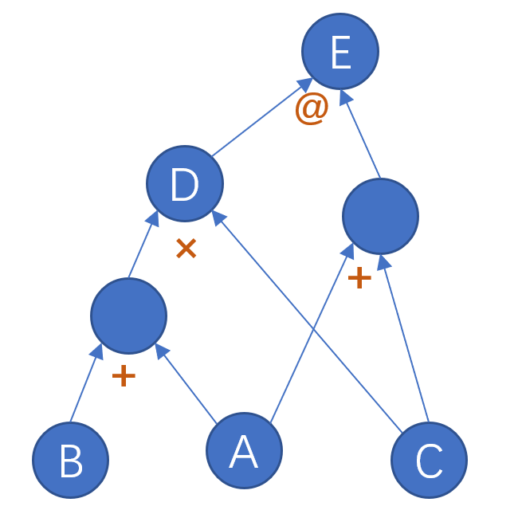
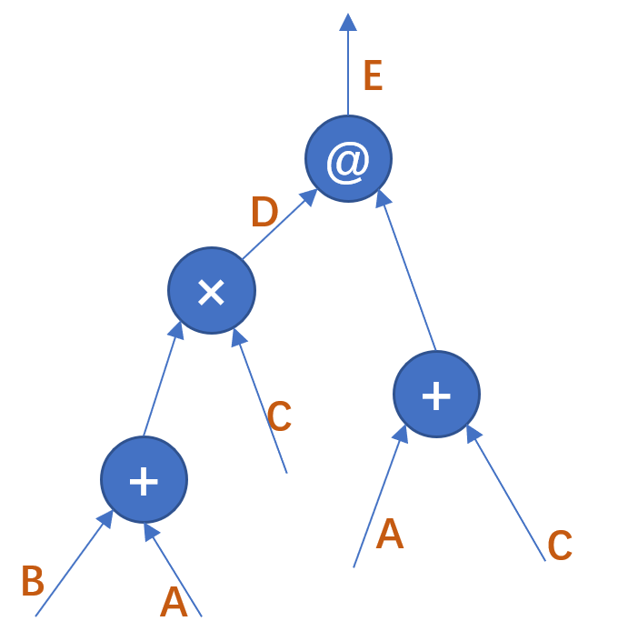

- [自动微分（2）](#自动微分2)
  - [预备知识](#预备知识)
  - [原型实现（python）](#原型实现python)
    - [1. 数据结构](#1-数据结构)
    - [2. 计算节点](#2-计算节点)
    - [3. 计算引擎](#3-计算引擎)
  - [原型实现（c++）](#原型实现c)

# 自动微分（2）

这里为什么又提到了自动微分呢，和 [chap3](./chap3) 不一样，这一章是手写自动微分引擎完成自动微分。其实这一章本来不在我的计划中，但是最近工作中遇到了一点构建自动微分引擎需求，所以突然打算在这里写一个原型。


## 预备知识

首先一定要明白的是自动微分的原理——链式法则和 vjp，链式法则可以在网上找到 N 多的博客，vjp 在[第三章](../chap3/readme.md#2-vector-jacobian-productvjp)也有简单介绍，简单来说就是输出梯度为输入梯度和雅各比矩阵的乘积。

关于自动微分引擎，通过我的调研找到两种原型，一种将张量当作计算图中的节点，另一种将算子当作计算图中的节点。前者很容易理解，计算图的连边是算子，如 `Sum`， `Mul` 等。可能是受到 陈天奇 大佬的 [CSE 599W](http://dlsys.cs.washington.edu)（[课程github](https://github.com/dlsys-course)）影响，在网上很多流行的 demo 都是类似的实现，在他的[第一个作业](https://github.com/dlsys-course/assignment1-2018)中，采用的就是这种方法。这里给出一个例子，对于 $A$，$B$，$C$，完成如下计算：
$$
\begin{aligned}
&D = (A+B)\cdot C \\
&E = D (A+C)
\end{aligned}
$$
（注意 $D$，$E$ 分别是哈达玛积和矩阵乘法）计算图可以用下面的方式表示：


对于这种方式实现的原型可以参考[这个博客](https://zhuanlan.zhihu.com/p/161635270)，我的实现也参考了他的部分代码。

这种实现中虽然容易理解，实现起来也不困那，但是这种原型中张量（或者数据）承担了部分维护上下文的功能，使得张量的功能太臃肿，其实最主要是不满足我的需求。我实现的是另一种方式，即将加减乘除等算子当作节点，可以看下面的计算图：


这种实现有一个很好的特性，上下文的维护可以独立于张量，很方便拓展和后续开发，如多线程。（我猜的，因为PyTorch底层的逻辑就是采用的第二种，每个节点正好能对应一次反向传播计算）


## 原型实现（python）

### 1. 数据结构
首先要做的事情就是定义一个数据结构代替张量，用 python 的话就很简单了，直接集成 `numpy.ndarray` 给他增加一个 grad 属性。为了尽量维持父类的特征，所以直接增加了一个 `__setattr__` 方法：
```python
class MyArray(np.ndarray):
    """
    Same with `np.ndarray` but `__setattr__` fucntion.
    """
    def __setattr__(self, __name, __value):
        self.__dict__[__name] = __value
```
因为 `numpy.ndarray` 的构造函数接受一个 `shape` 参数返回一个零 array。我写了一个丑陋的函数，通过 `requires_grad` 表示是否需要计算计梯度。
```python
def make_array(input_list, requires_grad=False):
    nparray = np.array(input_list)
    myarray = MyArray(nparray.shape)
    myarray[:] = nparray[:]
    if requires_grad:
        myarray.requires_grad = True
    return myarray
```

### 2. 计算节点
然后定义了一个计算节点基类，这里省略了部分注释和部分未实现的函数。先介绍每个变量的意义，`_edges` 计算节点的输入节点，即计算图的中边的“逆边”。`_depends` 是一个整形变量，用来标识当前计算节点被多少下游节点依赖，也即计算图的出边。`_inputs` 和 `_outputs` 分别保存了计算节点的输入和输出。两个 `_save` 函数分别用来保存输入和输出。

```python
class NodeBase:
    def __init__(self):
        self._edges = []
        self._depends = 0
        self._inputs = []
        self._outputs = []

    def __call__(self, *args, **kwds):
        return self.forward(*args, **kwds)

    def _save_inputs(self, *args):
        for a in args:
            self._inputs.append(a)
            if not hasattr(a, "requires_grad"):
                self._edges.append(a.fn)

    def _save_outputs(self, *args):
        for a in args:
            self._outputs.append(a)
```
具体实现以哈达玛积 `Mul` 为例，继承 `NodeBase` 类并实现 `forward` 和 `_backward` 函数。需要注意 `forward` 中除了计算结果还需要保存输入，输出和当前计算节点。 `_backward` 中根据 vjp 实现对应的功能即可。这里可以延申一下，如上图中存在两个 `Add` 计算节点都对应了变量 `A`，PyTorch 采用了 拓扑排序+累加梯度 的策略，也就是对两个节点的计算出来 `A` 的梯度求和，这也就是为什么在使用 PyTorch 的时候需要执行 `optmizer.zero_grad()`，否则梯度值会在上一个 epoch 的基础上继续累积。
```python
class MulOP(NodeBase):
    def __init__(self):
        super().__init__()

    def forward(self, a, b):
        self._save_inputs(a, b)
        output = a * b
        output.fn = self
        self._save_outputs(output)
        return output

    def _backward(self):
        if not hasattr(self._inputs[0], "grad"):
            self._inputs[0].grad = 0.0
        self._inputs[0].grad += self._outputs[0].grad * self._inputs[1]
        if not hasattr(self._inputs[1], "grad"):
            self._inputs[1].grad = 0.0
        self._inputs[1].grad += self._outputs[0].grad * self._inputs[0]
```
`_forward` 中还将当前节点的计算 `function` 给保存了下来，这一点是仿照的 PyTorch，形如注意 `b` 的输出，包含两项：
```bash
>>> a = torch.ones(2, requires_grad=True)
>>> b = a*a
>>> b
tensor([1., 1.], grad_fn=<MulBackward0>)
```
然后在 `_save_inputs` 中将输入的结果保存，这一点在 PyTorch 源代码中也有体现，但是 PyTorch 源代码中构建了一个 `Edge` 类来抽象这个行为，这里简化了。对于 PyTorch 源码感兴趣可以查看[罗西大佬的博客](https://www.cnblogs.com/rossiXYZ/p/15421453.html)。

### 3. 计算引擎
完成了以上基础类的实现之后，我们需要实现一个计算引擎，来控制协调整个反向计算过程。以上面提到的计算过程为例，反向执行的过程分别是 `MatMul`，`Mul`，`Add`，`Add`。如何要让机器完成上述过程呢，其实就是拓扑排序，因为计算图必定是一个有向无环图，而且反向计算依赖必定是下游计算节点，所以可以使用拓扑排序，从目标节点出发，根据拓扑次序依次完成反向计算。所以我们的计算引擎只需要完成一个拓扑排序并按照拓扑顺序依次执行计算节点的 `_backward` 函数即可。

关键代码如下，省略了部分检查和注释。初始化的时候保存了一个拓扑序列，使用 dfs 算法生成改拓扑顺序（对于反向计算图来说是拓扑逆序），同时没遇到一个节点就将其 `_depends` 加 1，除了根节点为 0。在反向计算函数中如果当前计算节点的 `_depends` 为 0，则说明该节点可以被执行，并将依赖该节点的 `_depends` 减 1。

```python
class BackwardEngine:
    def __init__(self, arr):
        self._target_arr = arr
        self._root = arr.fn
        self.topo_queue = []
        self._topological_sorting()

    def _topological_sorting(self):
        def _dfs(node):
            for next_node in node._edges:
                _dfs(next_node)
            node._depends += 1
            self.topo_queue.append(node)
        _dfs(self._root)
        self.root._depends = 0

    def run_backward(self, gradient=None):
        while len(self.topo_queue):
            task_node = self.topo_queue.pop()
            if task_node._depends == 0:
                task_node._backward()
                for n in task_node._edges:
                    n._depends -= 1
```


## 原型实现（c++）
（留坑）
